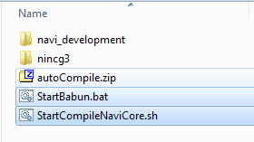
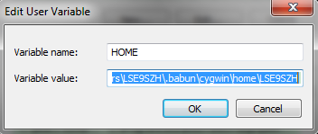
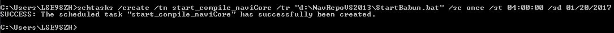
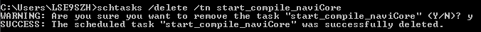

# Auto Compile

## Summary
In WinSim, the version of navi core should be consistent with the version of HMI middleware, additionally, due to the fact that the difference in time zones, HMI integration team generally release a version of HMI in the evening(indian time), so it will save considerable time of the day if we could compile navi core in the evening(maybe we are sleeping).
This script will compile navi core in Windows environment automatically . And it could also checkout source code for HMI and navi core automatically.
## Environment
WinSim
Windows command prompt
Babun
## How to start
1. Firstly, you should extract 'autoCompile.zip', and put 'StartBabun.bat' and 'StartCompileNaviCore.sh' in your source code directory.



2. Set environment variables.
HOME=home_for_babun
EX: `HOME= C:\Users\LSE9SZH\.babun\cygwin\home\LSE9SZH`


	
3. Edit 'StartBabun.bat', and change the path of 'nincg3', 'navi_development', 'StartCompileNaviCore.sh' to your local path
```
......
:RUN
"%MINTTY%" -h always -e /bin/sh -l -c 'source path_for_your_StartCompileNaviCore.sh path_for_your_nincg3 path_for_your_navi_development'
......
```
EX:
```
......
:RUN
"%MINTTY%" -h always -e /bin/sh -l -c 'source d:/NavRepoVS2013/StartCompileNaviCore.sh d:/NavRepoVS2013/nincg3 d:/NavRepoVS2013/navi_development'
......
```
	
If you'd like to get a version of nightly build, you should find out the root commit from release mail, ex:

root commit:3285f3b
	
Then add root commit to your StartBabun.bat
```
......
:RUN
"%MINTTY%" -h always -e /bin/sh -l -c 'source path_for_your_StartCompileNaviCore.sh path_for_your_nincg3 path_for_your_navi_development root_commit'
......
```

EX:
```
......
:RUN
"%MINTTY%" -h always -e /bin/sh -l -c 'source d:/NavRepoVS2013/StartCompileNaviCore.sh d:/NavRepoVS2013/nincg3 d:/NavRepoVS2013/navi_development 3285f3b'
......
```

4. Open window command prompt and start 'schtasks'
Note: You'd better close VS/SM/CGI/Git extensions before run schtasks.

windows command prompt:    
`schtasks /create /tn TaskName /tr TaskRun /sc schedule /st StartTime /sd StartDate`

EX:      

	
This command says, 'StartBabun.bat' will be started at 04:00:00, Jan 20th, the task name is 'start_compile_naviCore'.
	
Now you can have a cup of coffee. Everything is ready, you will use WinSim with the latest version tomorrow!      
By the way, you could execute the following command in window command prompt if you'd like to delete the task:           
windows command prompt:         
`schtasks /delete /tn TaskName`        
EX:       


We also fetch X86 NaviSDK for WinSim build from artifactory server instead of compiling NaviSDK, you just modify 'StartCompileNaviCore.sh'.

Please comment out this part 'Compile navi_development':
```
......
# -------------------------------------------------------------
# Compile navi_development
# -------------------------------------------------------------
#cfont -green "[navi_development] Compile navi_development..." -reset -n
#create_sdk --gen3 --rnaivi --debug --info
	 
#echo -e "\n"
......
```
and uncomment this part 'Download binaries from artifactory'
```
......
# -------------------------------------------------------------
# Download binaries from artifactory
# -------------------------------------------------------------
cfont -green "[navi_development] Download binaries from artifactory..." -reset -n
perl $_SWROOT/di_misc_tools/tools/artifactory/download_artifact.pl -m -r sw-navi-repos -g navi-sdk/rnaivi/winsim -a debug -v $MIDDLEWARE_TAG_ID -o ./sdk/gen3_rnaivi/Navigation

echo -e "\n"
......
```
